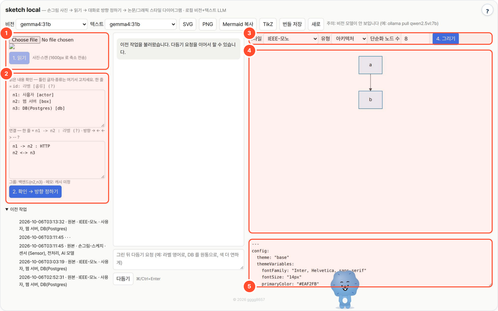

# sketch-local — 손그림 사진을 논문 figure / 그래픽 스타일 다이어그램으로

화이트보드·노트에 손으로 그린 다이어그램 사진을 올리면 로컬 비전 모델이 요소와 연결을 읽고, 사람이 확인·수정한 뒤 고른 스타일의 Mermaid 그림과 TikZ 코드로 다시 그립니다.



## 무엇을 하나

- 사진 → 비전 모델 판독(요소·연결·그룹·메모) → **사람이 확인** → 다시 그리기. 판독 결과를 그대로 믿지 않고 중간에 고칠 수 있게 했습니다.
- 방향은 **원본 그대로 / 단순화 / 인사이트 재구성** 중에서, 스타일은 논문-파스텔·IEEE-모노·Nature(Okabe-Ito)·Distill·손그림·플랫·다크·UML 8종 중에서 고릅니다.
- 결과는 SVG·PNG·Mermaid·TikZ(코드만)로 내보내 보고서·논문·슬라이드에 넣습니다.
- 파이썬 표준 라이브러리만, CDN 없음. 비전·텍스트 모델은 Ollama/vLLM 그대로 씁니다.

## 사용 방법

번호는 위 화면의 상자 번호입니다.

1. **원본 업로드** — 스케치 사진을 올리고 **1. 읽기**. 긴 변이 1600px를 넘으면 줄여서 보냅니다.
2. **요소·연결 확인** — 읽은 라벨(`n1: 라벨 [종류]`)과 화살표(`n1 -> n2 : 라벨`)를 고친 뒤 **2. 확인 → 방향 정하기**. 원본·단순화·인사이트 모드를 고르고, 애매한 부분만 묻는 질문(최대 3개)에 답합니다(기본값 그대로 둬도 됨).
3. **스타일·유형** — 스타일과 유형(자동·아키텍처·시퀀스·파이프라인·상태도·ER·마인드맵·블록)을 고르고 **4. 그리기**.
4. **그림 미리보기** — 생성된 Mermaid 다이어그램을 확인하고, 가운데 대화창에 "라벨 영어로", "DB를 원통으로" 같은 다듬기 요청을 합니다.
5. **소스** — Mermaid 소스를 확인합니다. 위쪽 **SVG / PNG / Mermaid 복사 / TikZ / 번들 저장**으로 내보냅니다. TikZ는 컴파일하지 않은 코드이므로 따로 확인하세요.

## 예시

위 화면은 저장된 기존 실행(2026-10-06, `2026-10-06-10db`, 원본 모드 · IEEE-모노 · 아키텍처, gemma4:31b)을 다시 연 것입니다.

- **입력**: `sketch.png` (손그림 아키텍처 스케치)
- **읽기 결과**(②): 요소 `사용자 [actor]`, `웹 서버 [box]`, `DB(Postgres) [db]`, 연결 `n1 -> n2 : HTTP`, `n2 <-> n3`, 그룹 `백엔드(n2,n3)`, 메모 "캐시 미정"
- **저장된 생성 소스**(`diagram.mmd`): `flowchart TB` / `n1["a"] --> n2["b"]`

이 실행에서는 생성 소스가 읽기 결과와 다르게 저장됐습니다. 손그림 복원이 성공한 사례가 아니므로, 그리기 결과는 항상 ②의 확인 내용과 대조해 보고 필요하면 다시 그리거나 다듬으세요.

## 설치·실행

```bash
bash setup.sh                 # OS → Python → LLM 서버 탐색 → 비전 모델 확인 → selftest → http://localhost:8774
bash setup.sh stop
python3 app.py --cli sample/sketch1.png --mode 단순화 --style 논문-파스텔 --type 아키텍처   # 질문엔 기본값, Mermaid 를 stdout
```

| 환경변수 | 기본 | 설명 |
|---|---|---|
| `LLM_API` | `ollama` | `ollama` 또는 `openai`(vLLM 등) |
| `LLM_BASE_URL` | `http://localhost:11434` / `:8000/v1` | 서버 주소 |
| `LLM_MODEL` | `qwen3:8b` | 텍스트 모델(그리기·다듬기·TikZ). 포털로 띄우면 로컬 Ollama `gemma4:31b` |
| `VISION_MODEL` | `qwen2.5vl:3b` | 비전 모델(읽기). 서버에선 `qwen2.5vl:32b` 급 권장 |
| `LLM_API_KEY` | (없음) | OpenAI 호환 서버 키 |
| `NUM_CTX` | `16384` | Ollama 컨텍스트 |
| `PORT` | `8774` | |
| `WORKSPACE` | `./_workspace` | 실행 기록·번들 저장 폴더 (포털이 도구별 데이터 폴더로 지정) |

## 흐름

1. **읽기** — 사진(1600px 로 축소) → 비전 모델 → `{elements, edges, groups, handwriting_notes, guessed_type}` JSON. 서버가 id·방향을 정규화하고 모르는 방향은 `?`+불확실로 표시.
2. **확인** — 읽은 요소/연결을 한 줄 형식으로 보여주고 사용자가 고침 (`n1: 라벨 [종류] (?)`, `n1 -> n2 : 라벨 (?)`).
3. **방향 정하기** — 모드 선택(원본 그대로 / 단순화 N개 이하 / 인사이트 재구성) → 불확실 항목만 질문(최대 3, 기본값 제공) → 스타일·유형 추천(바꿀 수 있음).
4. **그리기** — 텍스트 모델이 Mermaid 작성, 서버가 프리셋(frontmatter 테마·classDef)을 붙여 브라우저에서 렌더. 파싱 오류면 LLM 자동 수정 1회. 인사이트 모드는 해설 문단 추가.
5. **다듬기** — "라벨 영어로", "DB 를 원통으로" 같은 요청으로 반복 수정.
6. **내보내기** — SVG / PNG / Mermaid 소스 / TikZ(코드만) / 번들 저장(`$WORKSPACE/<id>/` 에 sketch.png·bundle.json·diagram.mmd).

스타일 8종과 조사 근거는 [STYLES.md](STYLES.md). 유형: 자동·아키텍처·시퀀스·파이프라인·상태도·ER·마인드맵·블록.

## 폐쇄망
폴더 복사만으로 동작(의존성 0, `static/mermaid.min.js` 동봉). 비전 모델(VL)과 텍스트 모델만 서버에 있으면 됨. OpenAI 호환 서버는 이미지 입력(`image_url` data URI)을 지원해야 함(vLLM 의 VL 모델은 지원).

## 한계
- 질문 생성은 규칙 기반(불확실 플래그만 묻는다). 더 똑똑한 질문이 필요하면 `questions()` 를 LLM 로 승급.
- classDef 색상은 flowchart/상태도에만 적용, 시퀀스·ER 은 테마 변수만.
- TikZ 는 컴파일하지 않은 코드. 3B 비전 모델은 점선 묶음·"?" 메모 같은 미묘한 표시를 놓치기도 함(테스트에서 그룹 범위를 과하게 잡음).

## 출처·감사 (Credits)

- 동봉: [mermaid](https://github.com/mermaid-js/mermaid) 11.17.2 (MIT) — [diagram-local](https://github.com/gggg8657/diagram-local) 과 같은 파일
- 색 프리셋: Okabe & Ito 색각 친화 팔레트 (Wong, *Nature Methods* 8:441, 2011) — 색 값만 참고
- **LLM 실행** — OpenAI 호환 API 로 호출합니다(모델 가중치는 동봉하지 않음). 기본 배포는 [Ollama](https://github.com/ollama/ollama) (MIT) 위의 Google [Gemma](https://ai.google.dev/gemma) `gemma4:31b` — 모델 이용 조건은 Gemma 배포처 참고.
- 이 도구는 [agent-page-portal](https://github.com/gggg8657/agent-page-portal) 에 연결해 쓰도록 만들었습니다(단독 실행도 됨).

저작권 표기·전체 목록은 `NOTICE` 를 보세요.

## 라이선스

MIT License — Copyright (c) 2026 gggg8657 (DongJu Kim). `LICENSE` 참고.
